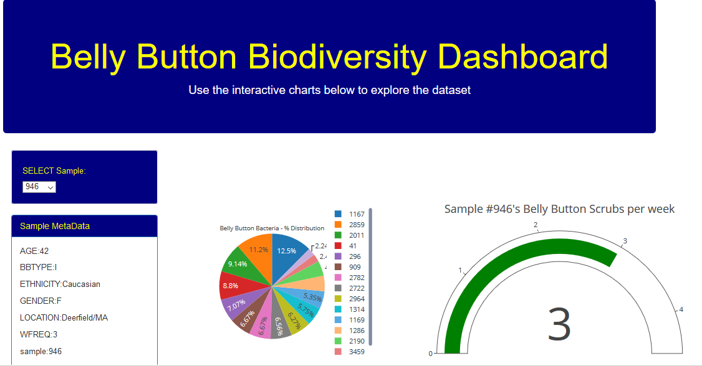
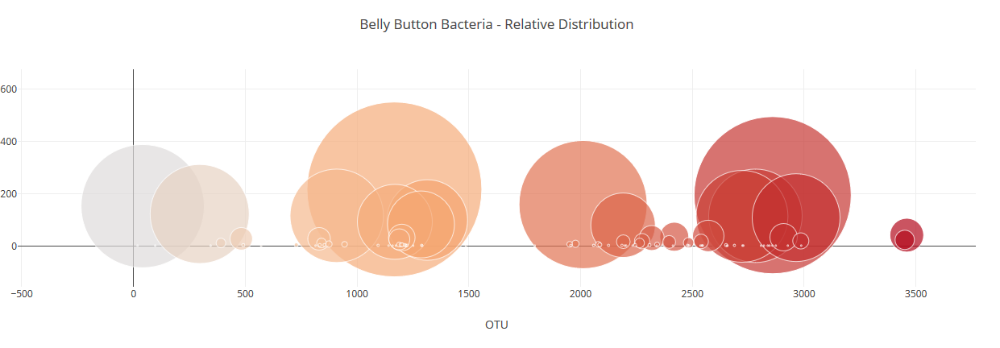

# Plotly - Belly Button Biodiversity

In this project, I created an interactive Full-Stack dashboard to explore the [Belly Button Biodiversity DataSet](http://robdunnlab.com/projects/belly-button-biodiversity/).

## Overview
This is a full-stack visualization with the full app available on Heroku (see below). 
Datasets are provided in SQL (SQLite) and are accessed through Python using SQL Alchemy library. 
The data is then processed and rendered through Javascript using Plotly commands. 
HTML and CSS styling set the front-end visualization. 

Some examples of the dashboard are shown below

## Code Execution Steps
This is an interactive | full-stack dashboard app utilizing JavaScript, HTML, CSS, Python and SQLite (Flask)

The app is available for general view: https://belly-scrub-92129.herokuapp.com/
Heroku deployment was deployed through the github process (outlined on Heroku.com)

Alternatively, the app can be viewed by a command line from this directory: 'python app.py' and viewing output @ URL: http://127.0.0.1:5000/

- - -

### Copyright

UCSD Data Science Bootcamp © 2019. All Rights Reserved.
